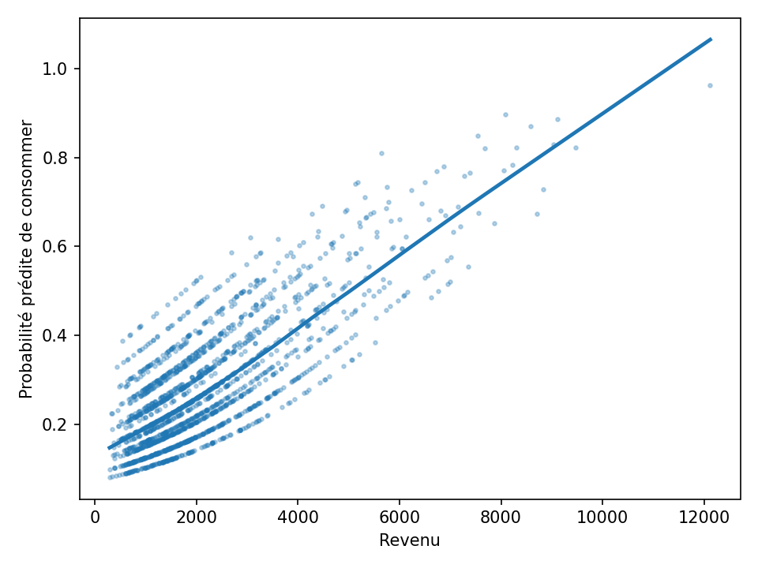

# Économétrie appliquée – Modélisation du comportement de consommation (Python)

## Objectif
Estimer la probabilité qu’un ménage consacre une part importante de son budget à une catégorie de produits (ex. bio, culture, loisirs) en fonction de ses caractéristiques socio-économiques.

## Méthodologie
- Jeu de données simulé reproduisant la structure d’une enquête INSEE.  
- Estimation d’un modèle Logit binaire (statsmodels – Python).  
- Analyse des effets marginaux pour l’interprétation économique.  
- Visualisation de la probabilité prédite selon le revenu.

## Outils
`Python`, `pandas`, `statsmodels`, `matplotlib`, `seaborn`

## Résultats
- Le revenu et le niveau d’éducation augmentent significativement la probabilité de consommation.  
- Les effets marginaux montrent une élasticité plus forte pour les ménages à revenu moyen.

