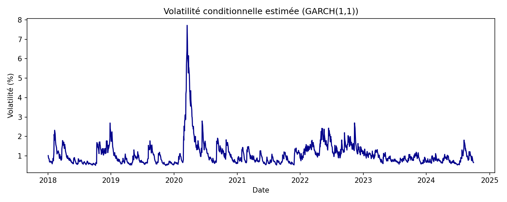
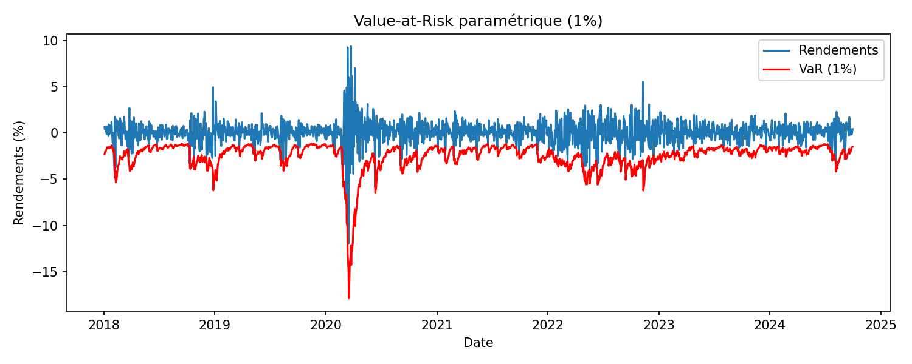

# Économétrie financière – Modélisation de la volatilité et Value-at-Risk (GARCH)

## Objectif
Estimer la volatilité conditionnelle d’un indice boursier (S&P 500) à l’aide d’un modèle **GARCH(1,1)**  
et calculer la **Value-at-Risk (VaR)** pour évaluer le risque extrême.

## Méthodologie
- Récupération des données historiques de prix (Yahoo Finance via `yfinance`).  
- Calcul des rendements journaliers.  
- Estimation du modèle GARCH(1,1) avec la librairie `arch`.  
- Calcul et visualisation de la VaR paramétrique à 1 %.  

## Outils
`Python`, `pandas`, `arch`, `matplotlib`, `scipy`, `yfinance`

## Résultats
- Le modèle GARCH capture bien les pics de volatilité observés en période de crise.  
- La Value-at-Risk permet d’identifier les seuils de pertes extrêmes sur le marché.  

**Volatilité conditionnelle estimée :**

**Value-at-Risk (1 %) :**

