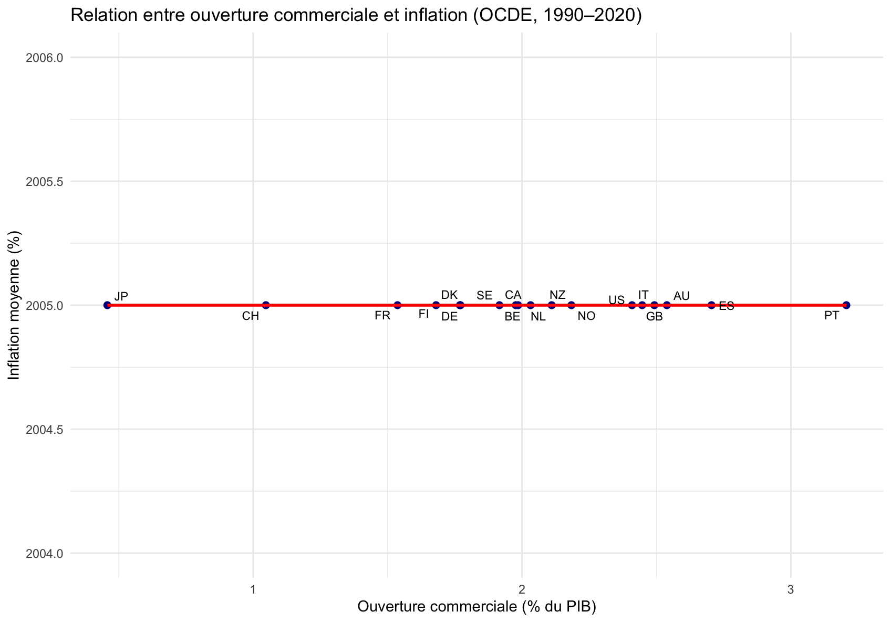

# Ouverture commerciale et inflation – Analyse en panel (R)

## Objectif
Étudier la relation entre **l’ouverture commerciale** (exportations + importations / PIB)  
et le **taux d’inflation**, à partir des données de la Banque mondiale (WDI) pour les pays de l’OCDE entre 1990 et 2020.

## Méthodologie
- Données récupérées avec le package `WDI`.  
- Estimation d’un modèle de panel avec effets fixes pays (`plm`).  
- Tests de robustesse : erreurs standards clusterisées, tests de Hausman.  
- Visualisation du lien entre ouverture commerciale moyenne et inflation.  

## Outils
`R`, `WDI`, `plm`, `lmtest`, `ggplot2`, `sandwich`

## Résultats
- L’ouverture commerciale a un **effet négatif et significatif** sur le taux d’inflation moyen.  
- Les effets fixes captent les différences structurelles entre pays (productivité, politique monétaire…).  
- L’ouverture accrue contribue à la **stabilité des prix à long terme**.

Le test indiquait que les effets fixes étaient plus appropriés, ce qui confirme qu’il existe des spécificités structurelles propres à chaque pays.
Cela renforce la robustesse du lien entre ouverture commerciale et inflation